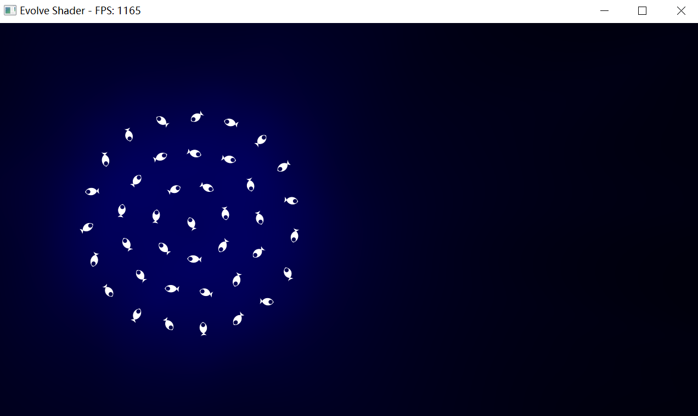
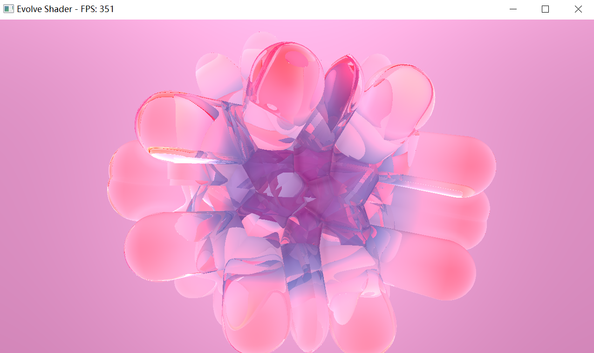

# Evolve Shader Viewer

A minimal **Shadertoy-like shader viewer** written in C++ with OpenGL 3.3 and GLFW.  
Supports both shaders with textures (`iChannel0`) and shaders without textures. Provides realtime rendering with mouse interaction and FPS display.


## Example Screenshot



---

# **使用文档**

---

## 📌 简介

``Evolve Shader Viewer是一个基于 OpenGL 的多通道着色器渲染程序，灵感来源于 [Shadertoy](https://www.shadertoy.com/)。它支持加载多个 `.frag` 片段着色器文件，并通过交互式配置实现复杂的多通道渲染（如后处理、反馈、图像输入等）。

该程序允许用户：
- 自定义每个着色器对其他缓冲区或图像的依赖。
- 支持全局图片资源作为 `iChannel` 输入。
- 实现自反馈（feedback）、链式渲染、HDR 输出等功能。

---

## 🧰 运行环境要求

- 操作系统：Windows / Linux / macOS
- 显卡：支持 OpenGL 3.3 及以上版本
- 编译器：支持 C++17 的编译器（如 GCC, Clang, MSVC）
- 第三方库：
  - GLFW
  - GLAD
  - STB Image（内嵌）

> ✅ 推荐使用现代显卡驱动以获得最佳性能与兼容性。

---

## 📁 目录结构

运行本程序前，请确保项目目录下有以下两个关键子目录：

```
project_root/
├── main.cpp
├── glad/          # GLAD 头文件和源码
├── GLFW/          # GLFW 库链接
├── stb_image.h    # 图像加载头文件
│
├── frag/          # 存放 .frag 着色器片段文件
│   ├── 0_base.frag
│   ├── 1_blur.frag
│   └── 2_feedback.frag
│
└── iChannel/      # 存放可被用作纹理输入的图像文件（可选）
    ├── photo.jpg
    └── textures/pattern.png
```

---

## 🛠️ 快速开始

### 步骤 1：准备着色器文件

将你的 GLSL 片段着色器保存为 `.frag` 文件，放入 `frag/` 目录中，命名建议带编号以便排序：

```glsl
// frag/0_base.frag
void mainImage(out vec4 fragColor, in vec2 fragCoord) {
    vec2 uv = fragCoord / iResolution.xy;
    fragColor = vec4(uv, 0.5 + 0.5 * sin(iTime), 1.0);
}
```

> ⚠️ 注意：不需要写 `main()` 函数主体，只需定义 `mainImage(out vec4, in vec2)` 即可。

### 步骤 2：编译并运行程序


> 在 Windows 上可使用 Visual Studio 或 MinGW 配合相应库进行构建。

---

## 🔧 程序启动流程

1. **扫描 `iChannel/` 文件夹中的图像**  
   所有 `.png`, `.jpg`, `.jpeg` 文件会被列出并可用于后续作为 `iChannel` 输入。

2. **扫描 `frag/` 中的 `.frag` 文件**  
   按文件名中的数字自动排序（例如 `0_main.frag`, `1_blur.frag` → 按序执行）。

3. **进入交互式配置模式**

   启动时会提示你配置每个 pass 的 `iChannel0 ~ iChannel3` 输入来源：

   ```
   === Interactive iChannel Setup ===
    Press Enter for auto-chain (buffer0 → buffer1 → ...),
    or type a buffer index to configure manually: 
   ```

   - 直接回车 → 启用“自动链式”：每个 pass 默认从上一个 pass 获取输出（`buffer[n-1] → buffer[n]`）。
   - 输入编号（如 `1`）→ 手动配置该 pass 的所有 channel 输入。

---

## 🎮 交互式配置说明

当你输入一个 Pass 编号后，系统会让你为它的四个 `iChannel` 分别选择输入源：

```text
Configuring buffer1 (blur.frag):
iChannel0 source:
  1: none
  2: self (feedback)
  3: buffer0
  4+: image (see global list below)
> 
```

选项含义如下：

| 选项 | 含义 |
|------|------|
| `1` | 不连接任何输入（黑图） |
| `2` | 使用当前 pass 自身的前一帧输出（用于反馈效果） |
| `3~N+2` | 使用前面某个 pass 的输出缓冲区（如 `buffer0`） |
| `N+3+` | 使用 `iChannel/` 中的图像文件 |

示例：若你有 2 个 shader，则 `buffer0` 和 `buffer1` 存在；若 `iChannel` 列表中有 3 张图，则图像索引从 `(base=5)` 开始。

> 💡 提示：你可以中途跳过剩余 channels 的设置。

完成所有手动配置后，按回车退出配置模式。

> ✅ 若某 Pass 完全未配置任何 channel，系统将自动将其 `iChannel0` 设为前一个 pass 的输出。

---

## 🎨 功能特性详解

### ✅ 多通道渲染（Multi-pass Rendering）

每个 `.frag` 文件代表一个渲染 pass，顺序执行并将结果写入 FBO（浮点纹理），最后一个 pass 输出到屏幕。

- 支持最多 N 个 passes（取决于 `.frag` 文件数量）。
- 中间缓冲区格式为 `GL_RGBA16F`（半精度浮点），支持 HDR 渲染。

### ✅ 全局图像输入（iChannel from Files）

所有 `iChannel/*.png/.jpg` 图像可在配置中作为 `iChannel` 输入使用。

- 路径缓存避免重复加载。
- 支持子目录结构。
- 自动翻转 Y 轴（适配 OpenGL 坐标系）。

### ✅ Shadertoy 兼容语法

你写的 `.frag` 文件可以直接移植自 Shadertoy，支持以下 uniform：

| Uniform         | 类型       | 描述 |
|------------------|------------|------|
| `iResolution`   | `vec3`     | 当前分辨率（xy）和 dpi 缩放（z） |
| `iTime`         | `float`    | 自启动以来的时间（秒） |
| `iTimeDelta`    | `float`    | 上一帧时间间隔 |
| `iFrame`        | `int`      | 帧计数器 |
| `iMouse`        | `vec4`     | 鼠标位置 `(x,y,down,_)` |
| `iChannel0~3`   | `sampler2D`| 纹理输入 |
| `iChannelResolution[4]` | `vec3[]` | 每个 channel 的分辨率信息 |

### ✅ 自反馈（Feedback Effects）

启用 `iChannel` 类型为 “self” 可实现延迟反馈效果（如光 trails、递归模糊）：

```glsl
// 示例：反馈混合
void mainImage(out vec4 fragColor, in vec2 fragCoord) {
    vec2 uv = fragCoord / iResolution.xy;
    vec4 prev = texture(iChannel0, uv); // self feedback
    vec4 current = /* some new color */;
    fragColor = mix(current, prev, 0.95); // 残影效果
}
```

> ⚠️ 注意：首次运行时 feedback 内容为空（黑屏），需几帧才能建立状态。

### ✅ sRGB 支持

启用窗口 sRGB 模式，保证颜色正确显示：

```cpp
glfwWindowHint(GLFW_SRGB_CAPABLE, GLFW_TRUE);
...
if (glfwGetWindowAttrib(window, GLFW_SRGB_CAPABLE)) {
    glEnable(GL_FRAMEBUFFER_SRGB);
}
```

---

## 🖱️ 用户交互

| 操作             | 效果 |
|------------------|------|
| 移动鼠标         | 更新 `iMouse.xy` 值 |
| 左键点击         | 设置 `iMouse.z = 1.0`（按下状态） |
| 窗口大小改变     | 自动重建所有 FBO 并调整视口 |
| 关闭窗口         | 安全释放资源并退出 |

FPS 显示在窗口标题栏中（每秒刷新一次）。

---

## 📂 文件命名规范建议

为了正确排序，请使用如下格式命名 `.frag` 文件：

```
0_base.frag
1_blur.frag
2_feedback.frag
...
```

> ❌ 错误示例：`blur.frag`, `effect.frag` → 无法确定执行顺序！

---

## 🧪 调试技巧

- 若出现着色器编译错误，程序会打印详细日志到控制台。
- 若纹理加载失败，会返回一张黑色占位图（不影响运行）。
- FBO 创建失败通常是因为显卡不支持 `GL_RGBA16F` 格式（极少见）。

---

## 📎 示例项目结构

```
demo_project/
├── frag/
│   ├── 0_noise.frag
│   ├── 1_blur.frag
│   └── 2_composite.frag
├── iChannel/
│   ├── tex_wood.jpg
│   └── logo.png
└── renderer.exe
```

假设：
- `0_noise.frag` 生成动态噪声；
- `1_blur.frag` 对 `buffer0` 做高斯模糊；
- `2_composite.frag` 将模糊层与原始噪声叠加。

配置方式：
- `buffer1`: `iChannel0 = buffer0`
- `buffer2`: `iChannel0 = buffer0`, `iChannel1 = buffer1`

即可实现复合视觉效果。

---

## 📜 许可证

本项目采用 MIT 许可证。第三方依赖请遵循其各自协议：

- [GLFW](https://www.glfw.org/license.html) – zlib/libpng 许可证
- [GLAD](https://github.com/Dav1dde/glad) – MIT
- [stb_image.h](https://github.com/nothings/stb) – Public Domain

---

## 🙌 致谢

感谢以下开源项目的支持：
- GLFW – 窗口与输入管理
- GLAD – OpenGL 扩展加载
- STB – 简单高效的图像解码
- Shadertoy – 创意灵感来源

---

👉 **Happy Coding & Evolving Shaders!**
