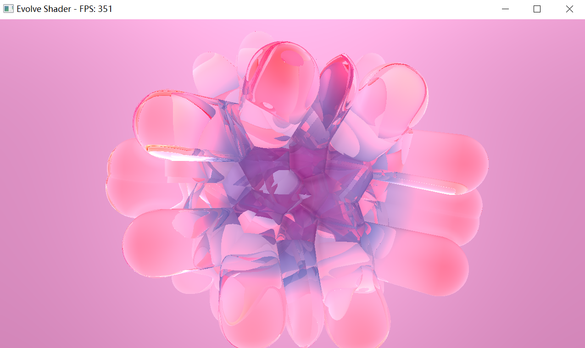

# Evolve Shader Viewer

A minimal **Shadertoy-like shader viewer** written in C++ with OpenGL 3.3 and GLFW.  
Supports both shaders with textures (`iChannel0`) and shaders without textures. Provides realtime rendering with mouse interaction and FPS display.


## Example Screenshot



---

## Features

- Run any Shadertoy `mainImage` fragment shader.
- Optional texture support (`iChannel0`) via `img/` folder.
- Real-time rendering with OpenGL 3.3 Core Profile.
- Mouse input support (`iMouse` uniform).
- Resolution (`iResolution`) and time (`iTime`) uniforms included.
- FPS counter displayed in window title.
- **Easy to run in Visual Studio 2022** – just open the solution and start debugging.

---

## Dependencies

- **Visual Studio 2022** (C++17 or newer)
- **GLFW** 3.3 or newer
- **GLAD** OpenGL loader
- **stb_image** for image loading

> All required libraries are included or can be added via vcpkg or NuGet.

---

## Project Structure


EvolveShader/
├─ img/               # Optional textures for shaders
├─ shader.frag        # Your Shadertoy fragment shader (mainImage only)
├─ main.cpp           # Main application code
├─ EvolveShader.sln   # Visual Studio solution
├─ README.md          # Project documentation

````

> Note: `img/` folder is optional. Shaders without textures will still run.

---


## Shader Format

- Your `shader.frag` should **only contain the `mainImage` function**:

```glsl
void mainImage(out vec4 fragColor, in vec2 fragCoord) {
    vec2 uv = fragCoord / iResolution.xy;
    fragColor = vec4(uv, 0.5+0.5*sin(iTime), 1.0);
}
````

* Do **not** include `#version` or `main()` function; these are automatically added by the program.

---


## License

This project is licensed under **MIT License**.

Shaders used are assumed to be **user-provided** or **public domain / CC0**.

---

## Notes

* Currently supports only `iChannel0`.
* Designed for quick testing of Shadertoy shaders locally on your machine.
* No CMake needed, fully integrated into Visual Studio 2022 workflow.

